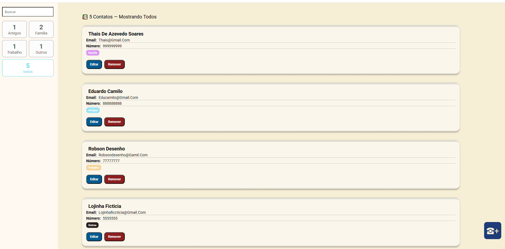
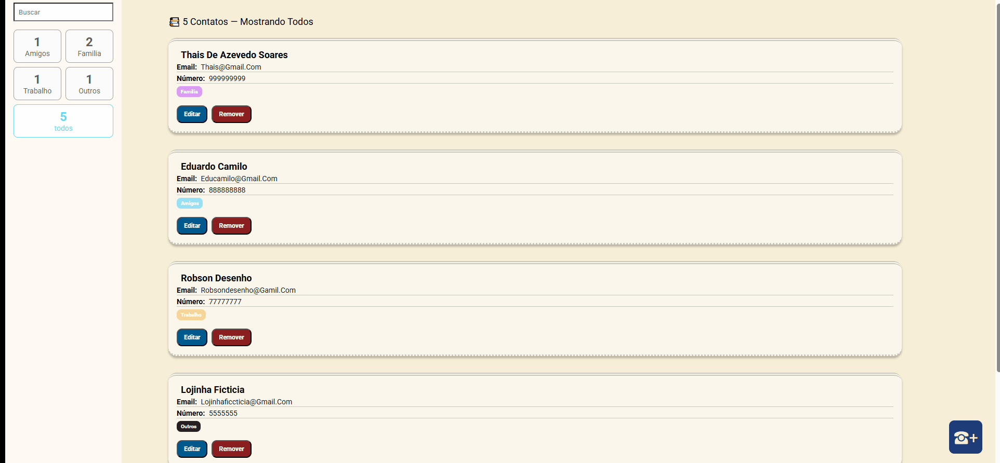
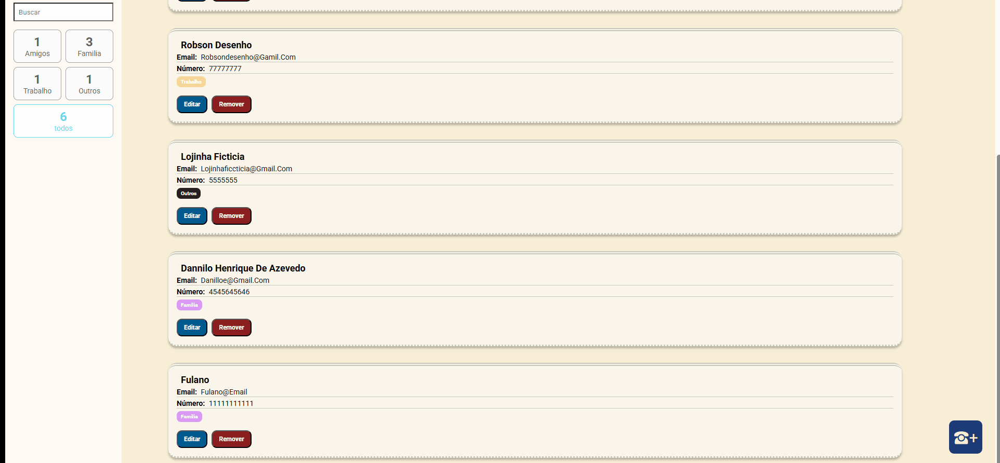
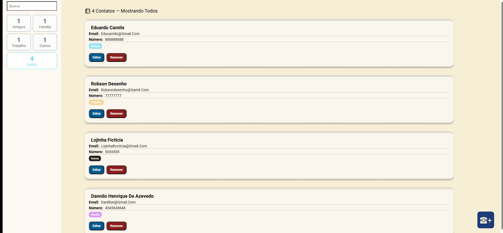

# 📇 Minhas Tarefas / Lista de Contatos

Aplicação de gerenciamento de contatos desenvolvida com **React + TypeScript**, permitindo **adicionar, editar, remover e filtrar contatos por categoria ou busca**.

O projeto foi desenvolvido com foco em praticar **arquitetura de aplicações React**, gerenciamento de estado global com **Redux Toolkit**, navegação com **React Router** e estilização com **Styled Components**.

---

# 📸 Preview

## Interface da aplicação

## Adicionando contato

---

---

---

---

# 🚀 Tecnologias utilizadas

---

# 📚 Conceitos praticados

Durante o desenvolvimento deste projeto foram praticados diversos conceitos importantes do ecossistema React:

- Estruturação de aplicações com **React**
- Tipagem estática utilizando **TypeScript**
- Gerenciamento de estado global com **Redux Toolkit**
- Navegação entre páginas com **React Router**
- Componentização da interface
- Separação entre **containers e componentes**
- Filtragem dinâmica de dados
- Manipulação de formulários controlados
- Estilização utilizando **Styled Components**
- Organização de pastas e arquitetura de projeto

---

# 🧠 Funcionalidades

## ➕ Adicionar contato

O usuário pode cadastrar novos contatos informando:

- Nome
- Email
- Telefone
- Categoria

Categorias disponíveis:

- Família
- Amigos
- Trabalho
- Outros

---

## ✏️ Editar contato

Os contatos podem ser editados diretamente na interface.

É possível alterar:

- Nome
- Email
- Telefone
- Categoria

---

## ❌ Remover contato

Cada contato pode ser removido da lista com um clique.

---

## 🔍 Busca de contatos

A aplicação possui um campo de busca que permite encontrar contatos por:

- Nome
- Email
- Número de telefone

---

## 🏷️ Filtro por categoria

Os contatos podem ser filtrados por categoria:

- Amigos
- Família
- Trabalho
- Outros
- Todos

O sistema também mostra **quantos contatos existem em cada categoria**.

---

# ⚙️ Gerenciamento de estado

O estado global da aplicação é gerenciado com **Redux Toolkit**, utilizando dois reducers principais:

### contatos

Responsável por:

- armazenar contatos
- adicionar novos contatos
- editar contatos existentes
- remover contatos

---

### filtro

Responsável por:

- termo de busca
- filtro por categoria
- controle dos resultados exibidos

---

# ▶️ Como executar o projeto

- 1️⃣ Clonar o repositório
  - git clone https://github.com/seu-usuario/minhas-tarefas.git
- 2️⃣ Instalar dependências
  - npm install
- 3️⃣ Rodar o projeto
  - npm start
A aplicação abrirá em:http://localhost:3000
---

# 🎓 Objetivo educacional

Este projeto foi desenvolvido com o objetivo de praticar **conceitos modernos do ecossistema React**, incluindo gerenciamento de estado com Redux, tipagem com TypeScript e organização de projetos front-end escaláveis.

---

# ⚠️ Observações

Este projeto utiliza **dados locais**, sem integração com backend ou banco de dados.

Os contatos são armazenados apenas na memória da aplicação.

---

# 👨‍💻 Autor

**Vitor dos Reis Soares**
